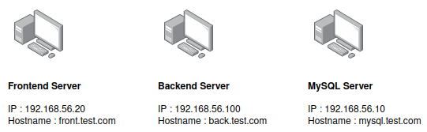

# DevOps Project

## Set up initial environments - back, front and mysql 

1. Create 3 virtual machines with Debian 10.

2. Machines must have 2 network interfaces : NAT or Bridged Adapter and Host-only Adapter.
3. In our case of use, these 3 machines must have a static ip and a hostname. You can reproduce the communication scheme below or adapt it according to your needs.
<br/><br/>

<br/><br/>
*Useful to setup this configuration* : ./documentation/set_minimal_envs.md

4. Install SSH and generate a key in each of these servers.

```bash
sudo apt install openssh-server -y
sudo apt install ufw
sudo ufw allow ssh

cd /root/.ssh/
sudo ssh-keygen
```

5. Install Python in each servers.
```bash
sudo apt install python -y
```
6. Install Ansible in each servers.
```bash
sudo apt update -y
sudo apt install ansible -y
ansible --version
```
7. You need a fourth machine to run the ansible script to install all dependencies and environment requirements.

8. This main machine must to communicate with Back, Front, MySQL environments with a root  access. You need to put the main machine ssh key to authorized_keys file in root remote folder. You can follow the process below in each remote machines.
```bash
# In Main machine
sudo apt install openssh-server -y
cd ~/.ssh/
ssh-keygen

cat ~/.ssh/id-rsa.pub # Copy this output

ssh remote_username@ip_remote # Adapt remote_username and ip_remote values
nano key # Paste the output copied before and save
```

```bash
# In Remote machine
sudo ~/remote_username/key >> /root/.ssh/authorized_keys
```
9. Install Ansible in your main machine.
```bash
sudo apt update -y
sudo apt install ansible -y
ansible --version
```
10. Run the ansible script to install each environments.
```bash
ansible-playbook -i ansible/hosts ansible/playbook.yml
```
11. Now, you can access the front app on http://front.test.com. In this last case, you will need to edit your hostname file in your main machine. 